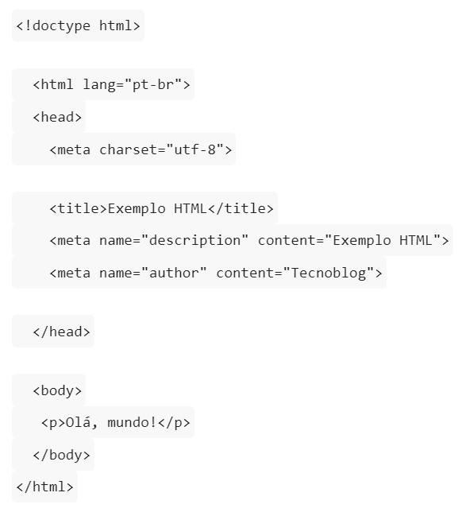
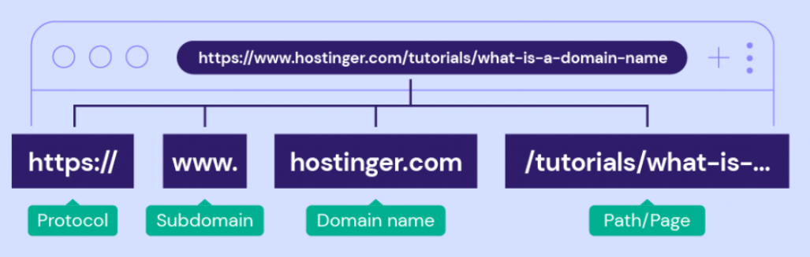

# pesquisa-AWS
Repositório referente a pesquisa que envolve AWS do programa catalisa

## O que é World Wide Web? - MURYLLO
R:World wide web ou WWW como conhecemos, significa literalmente uma teia de aranha mundial , normalmente chamamos de Web, é um sistema de documentos públicos colocados e disponibilizados na internet, em um formato de hipertexto acessível através de um programa de computador chamado, browser ou navegador, a Web desde então tem se tornado mais moderna e interativa, onde podemos fazer várias coisas, entre acessar mídias sociais, fazer uma compra etc.

## O que é Cloud? - MURYLLO
R: Cloud ou serviço em nuvem é uma rede de servidores Interligados com uma capacidade grande de armazenamento e processamento de dados onde nos permite uma maior elasticidade ou seja,por exemplo antigamente as empresas utilizavam servidores físicos, e para disponibilizar para o seus usuários era um custo muito alto,quando o cloud surgiu, ficou mais acessível disponibilizar os recursos de uma empresa através da internet, você não sabe o local físico do recurso disponibilizado, mas sempre que o usuário precisar ele vai estar lá guardado na nuvem um exemplo disso são os jogos,antigamente para ter acesso a um jogo a gente tinha que acessar mídias físicas como cartucho ou cd, hoje em dia se você quiser jogar um jogo, basta no seu console escolher o jogo que você quer e baixar.

## O que é HTML? - Iris
R: O HTML é o componente básico da web , seu acrônimo significa HiperText Markup Language, traduzindo ao português: Linguagem de Marcação de Hipertexto. A criação de qualquer página depende do HTML , porém ele não se enquadra como linguagem de programação, ele é considerado uma linguagem de marcação o qual  permite inserir o conteúdo e estabelecer a estrutura básica de um website, como dividir as seções do site, inserir hiperlinks, estruturar parágrafos, pular linhas no texto, ordenar listas, enfim, uma infinidade de comandos que são úteis na construção de um site, geralmente por um par de marcadores conhecidos como tags.

Um exemplo de uma página HTML que exibe a mensagem “Olá, mundo!” em um parágrafo.
Fonte da imagem: Tecnoblog

## O que é URL? - Iris
R: URL é o endereço de qualquer site na internet

A estrutura do  URL geralmente é composta por:
- Protocolo: é o esquema de comunicação usado para acessar o recurso, como HTTP (Hypertext Transfer Protocol) ou HTTPS (HTTP Secure) para páginas web, FTP (File Transfer Protocol) para transferência de arquivos, entre outros.
- Domínio: é o nome do servidor onde o recurso está hospedado. Por exemplo, em "www.exemplo.com", o domínio é "exemplo.com".
- Caminho: é o local específico onde o recurso está localizado no servidor. Por exemplo, em "www.exemplo.com/pagina", "/pagina" é o caminho.
- Parâmetros: são informações adicionais fornecidas na URL que podem influenciar o comportamento ou a exibição do recurso. Por exemplo, em "www.exemplo.com/pagina?parametro1=valor1&parametro2=valor2", os parâmetros são "parametro1=valor1" e "parametro2=valor2".
- Fragmento: é uma parte opcional da URL que se refere a um local específico dentro do recurso. Geralmente é indicado por um sinal de jogo da velha (#) seguido de um identificador. Por exemplo, em "www.exemplo.com/pagina#secao", "#secao" é o fragmento.

Exemplo de estrutura URL.Fonte: Hostinger Tutoriais.

## O que é o protocolo HTTP? - RICK
R: O HTTP é um protocolo usado na Internet que permite aos navegadores solicitar informações de servidores e receber respostas.
Ele é usado para acessar páginas da web e outros recursos online. O HTTP segue o modelo  cliente-servidor , onde o navegador envia solicitações e o servidor processa e envia respostas.
O protocolo é stateless, tratando cada solicitação independentemente.

## O que é uma API REST? - RICK
R: Uma API (Interface de Programação de Aplicativos) é como um canal de comunicação que permite que diferentes aplicativos ou sistemas interajam entre si. Ela define regras e formatos para essa interação.
Uma API REST é um tipo específico de API que segue certas diretrizes para facilitar a comunicação entre aplicativos. Ela usa a internet como base e utiliza URLs (endereços) e métodos HTTP (como GET e POST) para solicitar e enviar informações.
Em termos mais simples.

---
## Fontes:
 - https://tecnoblog.net/responde/o-que-e-html-guia-para-iniciantes/
 - https://www.buscape.com.br/pc-computador/conteudo/o-que-e-html
 - https://www.hostinger.com.br/tutoriais/url